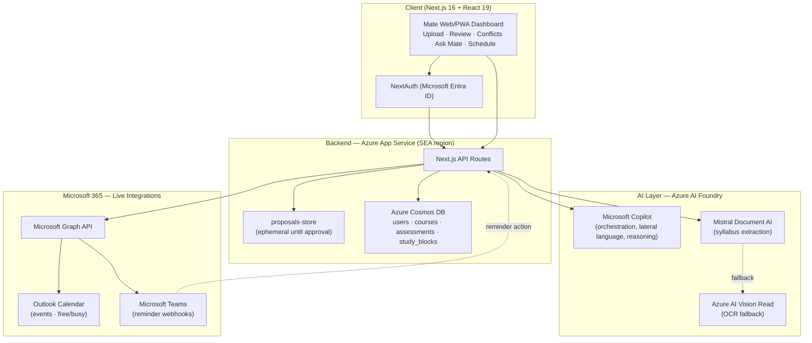
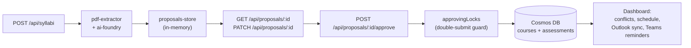
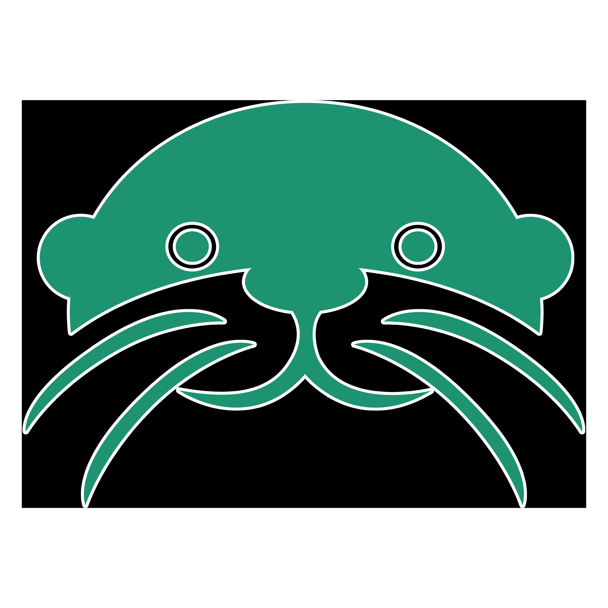

<div align="center">


# Mate

**Autonomous Academic Orchestrator for Filipino University Students.**

A Microsoft Copilot–powered SaaS that reads every syllabus, names the weeks where deadlines collide, and plans your study time around your real Outlook calendar and Teams availability.

<p>
  
  
  
  
  
</p>

<sub>👋 Meet Mate — your calm, judgment-free study partner.</sub>

</div>

---

## Demo Video

<div align="center">
  <a href="https://youtu.be/your-demo-link-here">
    
  </a>
  <br/>
  <sub>Click to watch the 5-minute walkthrough on YouTube</sub>
</div>

---

## Problem

Filipino university students face a **single structural failure** that surfaces as three compounding pains:

**The Extraction Burden.** Professors hand out scanned-PDF syllabi in week 1 and never mention them again. A student carrying six courses must manually read every document, copy every assessment, and transcribe every due date into a calendar app. The work is tedious, repetitive, and the failure mode is silent. Deadlines that were never extracted cannot be remembered.

**The Collision Blindness.** Even students who keep a flawless calendar discover too late that three majors are due in the same week. Existing planners list tasks. They do not reason about workload. They cannot tell a student in week 3 that week 11 is going to break them unless that student starts on a specific project today.

**The Tool Abandonment Loop.** Setup-heavy planners like Notion and MyStudyLife demand the exact executive function that overwhelmed students lack. Each abandonment compounds the shame. Generic LLMs like ChatGPT confidently fabricate dates that were never in the source document, and students learn not to trust them.

Existing tools record the absence of structure. They do not generate it. The market needs **an orchestrator, not another data repository.**

---

## Vision

A Philippines where every university student opens one calm dashboard and sees exactly what their semester looks like. Every deadline is already extracted. Every collision week is already named. Every study block is already proposed around the meetings the student has in Outlook and the reminders that reach them in Teams. The student never opens a syllabus PDF, a calendar template, or a planner app again.

Mate is the **central orchestrator** where extraction, reasoning, and integration become a single autonomous machine, so the student steps out of the logistics trench and focuses on actually learning.

---

## Purpose

Built for the **KPMG Academic Innovation Challenge 2026**, Mate was born from a structured research pass on Filipino student productivity. We found that the extraction burden, collision blindness, and tool abandonment loop are **not independent problems**. They are three faces of the same structural failure. Every syllabus contains the deadlines, every deadline contains the workload signal, and every student already lives inside Microsoft 365. You cannot solve one without solving all three.

We merged AI-powered document extraction, deadline conflict reasoning, adaptive scheduling, and live Microsoft 365 integration into a **single Copilot-powered pipeline**, because the integration is architecturally inseparable, not four products glued together.

---

## Target Users

- **Primary, the Commuter Undergraduate (Carlo).** 19 years old, BS Computer Science at a large public university, lives 2.5 hours from campus, six courses per term, Android phone with a hand-me-down laptop. Owns a calendar app and still misses deadlines. Realizes too late that three major requirements land in the same week. Already uses ChatGPT for academic help and does not trust its accuracy.
- **Secondary, the Neurodivergent Notion-Abandoner (Bea).** 21 years old, AB Communication at a private university, iPhone with a MacBook, self-diagnosed ADHD. Has abandoned three planner templates this year. Setup friction exceeds her patience window. Rigid scheduling tools trigger a shutdown response, and shame-based streaks make her quit entirely after a bad week.

---

## Features

- **Syllabus Ingestion via Mistral Document AI.** Drag-and-drop PDF upload. Mistral Document AI extracts course name, every assessment, and every due date into structured JSON with per-item confidence scoring.
- **Confidence-Scored Human-in-the-Loop Review.** Low-confidence items are flagged "needs review" rather than silently accepted. A View Metrics toggle reveals the raw ML probability behind every extraction. Nothing reaches the database until the student clicks Approve All.
- **Deadline Conflict Reasoning.** Mate scans across all uploaded courses and names the weeks where multiple major deliverables collide. Each collision week ships with a concrete early-intervention suggestion.
- **Adaptive Study-Block Scheduling.** Generate realistic study blocks that respect stated availability, map to upcoming deadlines by priority, and never overlap existing commitments.
- **Lateral Language Chat with Clarifying Questions.** Ask "help me plan my week" in plain language. Mate asks exactly one clarifying question when information is missing, then plans. Powered by Microsoft Copilot via Azure AI Foundry.
- **Outlook Calendar Two-Way Sync.** One click pushes approved study blocks into the student's real Outlook calendar as events through Microsoft Graph. Deleting an event in Outlook reflects on the next sync.
- **Microsoft Teams Reminder Webhooks.** Before each study block begins, Mate sends a native Teams notification with action buttons to mark done or push back, closing the gap between scheduling and actually being reminded.
- **Outlook Free/Busy Availability Feed.** The scheduler automatically pulls existing meetings from the student's Outlook so proposed blocks never collide with what they forgot to mention.
- **Latency-Masking Feedback.** A proactive "Reading now..." acknowledgment fires within one second of upload while the parse runs in the background, so the student never wonders if the app crashed.
- **Manual Entry Fallback.** When extraction confidence is critically low or parsing fails entirely, a guided manual entry flow takes over instead of presenting a dead end.
- **Accuracy Verification Harness.** A gold-labeled corpus of real PH syllabi at [`app/qa/`](app/qa/) verifies under 2% date error and zero fabricated dates on every prompt or model change.
- **Microsoft Entra ID Authentication.** Sign in with Microsoft, JWT session strategy, automatic access-token refresh, and `session.user.id` always pinned to the Entra subject ID.

---

## Tech Stack

| Layer | Technology |
| --- | --- |
| **Frontend** | Next.js 16 (App Router), React 19, TypeScript 5, Tailwind CSS |
| **Backend** | Next.js API Routes on Azure App Service |
| **Database** | Azure Cosmos DB (SEA region) |
| **AI Orchestration** | Microsoft Copilot / Azure OpenAI (GPT-class) via Azure AI Foundry |
| **Document Extraction** | Mistral Document AI via Azure AI Foundry |
| **OCR Fallback** | Azure AI Vision Read (planned for scanned PDFs) |
| **Authentication** | NextAuth v5 with Microsoft Entra ID |
| **Calendar Integration** | Microsoft Graph (Outlook events, free/busy) |
| **Messaging Integration** | Microsoft Teams (study-block reminders, webhooks) |
| **Accuracy Verification** | Gold-labeled corpus harness ([`app/qa/`](app/qa/)) |
| **Hosting** | Azure App Service (dev/test on MLSA subscription; commercial migration planned) |

---

## Architecture

### System Flow



### Proposal Lifecycle

The extraction → approval → persistence flow is the load-bearing path. Proposals are ephemeral until the student approves.



### Directory Structure

```
mate/
├── docs/                          Product documentation suite
│   ├── brd-mate.md                Business requirements
│   ├── prd-mate.md                Product requirements (binding spec, v0.5)
│   ├── dsd-mate.md                Design system
│   ├── sdd-mate.md                System design
│   ├── rfc-mate-syllabus-ingestion.md   Extraction architecture
│   ├── qad-mate.md                Quality assurance & accuracy gates
│   ├── clr-mate.md                Compliance & legal readiness
│   ├── gtm-mate.md                Go-to-market strategy
│   └── DEMO.md                    Demo video production guide & shot list
│
├── app/                           Next.js 16 demo SaaS
│   ├── src/app/
│   │   ├── api/                   API routes
│   │   │   ├── syllabi/           Upload & extraction
│   │   │   ├── proposals/         Review & approval
│   │   │   ├── courses/           Approved deadlines (grouped)
│   │   │   ├── assessments/       Per-deadline CRUD
│   │   │   ├── conflicts/         Collision week detection
│   │   │   ├── schedule/          Study block generation + reminders
│   │   │   ├── calendar/          Outlook events + availability sync
│   │   │   ├── teams/             Microsoft Teams reminder dispatch
│   │   │   ├── webhooks/          Inbound study-block lifecycle events
│   │   │   ├── chat/              Lateral-language chat with guardrails
│   │   │   └── auth/              NextAuth (Microsoft Entra ID)
│   │   ├── upload/                Upload page
│   │   ├── review/[id]/           Extraction review page
│   │   └── dashboard/             Tabbed dashboard
│   ├── src/components/            UI components
│   │   ├── ExtractionReview.tsx   Review panel with View Metrics toggle
│   │   ├── MateChat.tsx           Lateral-language chat (DSD §4)
│   │   ├── ConflictReport.tsx     Collision week display
│   │   ├── SchedulePlanner.tsx    Study block generator
│   │   ├── DeadlineManager.tsx    View/edit deadlines grouped by syllabus
│   │   ├── ManualEntryForm.tsx    Fallback when extraction fails
│   │   └── NavBar.tsx
│   ├── src/lib/                   Integration clients
│   │   ├── ai-foundry.ts          GPT + Mistral wrapper
│   │   ├── pdf-extractor.ts       PDF text extraction
│   │   ├── microsoft-graph.ts     Outlook calendar + free/busy
│   │   ├── microsoft-teams.ts     Teams reminder integration
│   │   ├── cosmos.ts              Cosmos DB client (singleton)
│   │   └── proposals-store.ts     In-memory proposal store
│   ├── qa/                        Accuracy verification harness
│   │   ├── corpus/                Gold-labeled syllabus fixtures
│   │   └── run-accuracy.ts        Diff predictions vs gold labels
│   └── README.md                  App setup, env vars, API reference
│
├── test/                          Canonical syllabus PDFs for demo
├── scripts/                       Prompt guardrail tooling
├── KPMG.md                        Official competition brief
├── Mate.md                        Market research report
├── AGENTS.md                      Contributor & agent guidance
├── CLAUDE.md                      Codebase orientation for Claude Code
└── README.md                      ← You are here
```

---

## How to Run Locally

### Prerequisites

- **Node.js 20+** and **npm 10+** (enforced in `app/package.json` engines)
- **Azure subscription** with AI Foundry deployments for GPT-class and Mistral Document AI
- **Microsoft Entra ID app registration** for NextAuth (sign-in with Microsoft)
- **Azure Cosmos DB** instance (NoSQL API)

### Frontend & Backend

```bash
cd app
npm install
npm run dev
```

Open [http://localhost:3000](http://localhost:3000).

### Connectivity Smoke Test

Verify Cosmos and AI Foundry credentials before running the full app:

```bash
cd app
npm run test:connections
```

### Environment Variables

Copy the example and fill in your values (Azure endpoints, deployment names, Entra ID credentials):

```bash
cp app/.env.example app/.env
```

Required keys (full list in [`app/README.md`](app/README.md)):

- `COSMOS_ENDPOINT`, `COSMOS_KEY`, `COSMOS_DATABASE`
- `AI_FOUNDRY_ENDPOINT`, `AI_FOUNDRY_KEY`
- `GPT5_DEPLOYMENT_NAME`, `MISTRAL_LARGE_DEPLOYMENT_NAME`, `MISTRAL_DOCUMENT_DEPLOYMENT_NAME`
- `AZURE_AD_TENANT_ID`, `AZURE_AD_CLIENT_ID`, `AZURE_AD_CLIENT_SECRET`
- `CONFIDENCE_THRESHOLD` (default `0.75`)

### Accuracy Harness

Verify extraction quality against the gold-labeled corpus:

```bash
cd app
npx ts-node qa/run-accuracy.ts
```

Pass criteria: date-extraction error rate under 2%, zero fabricated dates.

---

## Deployment

### Demo Environment

- **Hosting:** Azure App Service (`southeastasia` region)
- **Database:** Azure Cosmos DB (NoSQL, SEA region, disposable pilot instance)
- **AI:** Azure AI Foundry deployments for GPT-class and Mistral Document AI
- **Auth:** Microsoft Entra ID (Microsoft 365 developer tenant)
- **Licensing:** Microsoft Learn Student Ambassador Visual Studio Enterprise subscription (dev/test credit) plus M365 developer tenant. This is **dev/test-licensed only** and not suitable for production or paying users.

### Production Migration Plan

Commercial v1 requires migration to a separate, org-owned, commercially-licensed Azure subscription (e.g., Azure for Startups or Microsoft for Founders Hub) and an org-owned tenant before any public or paying user. Production identity and billing must never depend on a personal ambassador account. See [`docs/sdd-mate.md`](docs/sdd-mate.md) §1 and [`docs/clr-mate.md`](docs/clr-mate.md) for the full migration register.

### Canonical Test Fixtures

The [`test/`](test/) directory ships two real Philippine university syllabus PDFs that the team validates against:

- `CS-SOCSCI-SocSc12-TANGARA_A-F1-2022-1.pdf`
- `Latest_Multimedia_OBEorOBTLP-Format.pdf`

These are paired with gold labels at [`app/qa/corpus/`](app/qa/corpus/) for the accuracy harness.

---

## Demo

- **Demo Video:** [YouTube](https://youtu.be/your-demo-link-here) (5-minute walkthrough)
- **Production Guide:** [docs/DEMO.md](docs/DEMO.md) (shot list, voice-over, risk register)
- **Live App:** [mate.axonenjin.com](https://mate.axonenjin.com)

### Demo Walkthrough

The 5-minute video follows this order to showcase the full pipeline (full shot list in [docs/DEMO.md](docs/DEMO.md)):

1. **Hook + Stack** — Problem framing, then a one-overlay summary: Microsoft Copilot, Azure AI Foundry, Mistral Document AI, Microsoft Graph, Cosmos DB.
2. **Ingestion + Accuracy Proof** — Upload a real PH syllabus. View extraction with confidence scores. Flash the QA harness output showing under 2% error and zero fabrication.
3. **Conflict Reasoning** — Add a second syllabus. Mate names the collision week and suggests when to start each project.
4. **Lateral Language** — Type "help me plan my week" in the Ask Mate panel. Mate asks one clarifying question before answering.
5. **Adaptive Scheduling** — Study blocks render in priority order around stated availability.
6. **Outlook Calendar Sync (Live)** — One click pushes blocks to a real Outlook calendar through Microsoft Graph. Visible in a second browser window.
7. **Microsoft Teams Reminder (Live)** — A native Teams notification arrives before a block starts, with action buttons.
8. **Outlook Availability Feed** — The scheduler respects existing Outlook meetings automatically.
9. **Close** — Zero setup. Zero fabricated dates. Four capabilities, three live Microsoft 365 integrations.

---

## Team

**Team Name:** Axon Enjin

| Name | Role | GitHub |
| --- | --- | --- |
| Carlos Jerico Dela Torre | Product & Business Architect, Team Lead | [@delatorrecj](https://github.com/delatorrecj) |
| Rhandie Sales Jr. | Full Stack Engineer | [@r0undy](https://github.com/r0undy) |
| Aidan Tiu | DevOps Engineer | [@aidantiu](https://github.com/aidantiu) |

---

## Roadmap

| Phase | Focus | Status |
| --- | --- | --- |
| **Phase 1 — Competition Demo** | KPMG demo build. Four judged capabilities plus three live M365 integrations on dev/test Azure. | Current |
| **Phase 2 — Pilot Cohort** | Limited consenting pilot with PH university students. Disposable Cosmos instance. DPA-compliant data handling. | Next |
| **Phase 3 — Commercial v1** | Migrate to org-owned Azure subscription. Google Workspace integration. Mobile polish. Production hardening. | Planned |
| **Phase 4 — LMS Integration** | Canvas and Moodle ICS feeds first. Deep API integration as university partnerships mature. | Future |

### Post-Competition Priorities

| Priority | Item | Rationale |
| --- | --- | --- |
| **High** | Azure subscription migration to commercial license | MLSA dev/test subscription cannot legally host production or paying users |
| **High** | Azure AI Vision Read OCR fallback wired in | Scanned and image-only PDFs currently fail extraction silently |
| **High** | Google Workspace integration (Calendar, Classroom, Drive) | Ecosystem parity with Microsoft 365 was a load-bearing PRD commitment |
| **High** | DOC/DOCX support beyond PDF | Currently accepted on upload but not reliably processed |
| **Medium** | Mobile polish at 375px breakpoint | Primary persona (Carlo) uses Android, not desktop |
| **Medium** | Re-upload deduplication (same filename warning) | Pilot users will accidentally re-upload the same syllabus |
| **Medium** | DPA-compliant data deletion workflow | RA 10173 applies from pilot stage onward |

---

## Why Microsoft Copilot?

| Microsoft Primitive | How Mate Uses It |
| --- | --- |
| **Microsoft Copilot / Azure OpenAI** | Orchestrates lateral-language interpretation, clarifying-question generation, and conflict-week reasoning. The brief's "Primary Platform: Copilot Studio" means Copilot is the primary AI engine; Mate is an independent SaaS that calls it via API. |
| **Mistral Document AI on Azure AI Foundry** | Schema-constrained syllabus extraction. Returns structured JSON with per-item confidence. Returns `null` rather than fabricating a date when the source is ambiguous. |
| **Azure AI Vision Read** | OCR fallback for scanned and image-only PDFs (planned). Routed automatically when Mistral confidence is critically low. |
| **Microsoft Graph** | Two-way Outlook calendar sync for approved study blocks. Free/busy lookups so generated schedules respect existing meetings. |
| **Microsoft Teams** | Native reminder notifications before each study block begins, with action buttons for done/snooze. The notification meets students inside the tool they already live in. |
| **Microsoft Entra ID** | Single sign-on for Filipino university students with Microsoft 365 education tenants. `session.user.id` is always the Entra subject ID, never email. |
| **Azure Cosmos DB (SEA region)** | NoSQL document model matches the syllabus → assessments shape. SEA region satisfies the PH Data Privacy Act preference for in-country data localization. |
| **Azure App Service** | Hosts the Next.js 16 SaaS in `southeastasia`. Same deployment pattern from demo through commercial v1. |

---

## License

[MIT](LICENSE) for the application code. Documentation is part of the Mate project repository.

---

<div align="center">



<sub>KPMG Academic Innovation Challenge 2026 · © 2026 Axon Enjin</sub>

</div>
