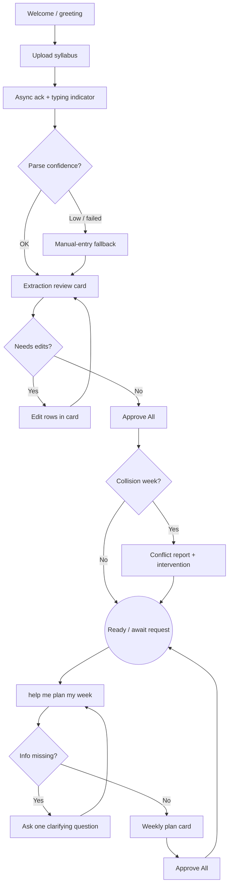

# Product Requirements Document (PRD)

**Project:** Mate — Autonomous Academic Orchestrator
**Date:** 2026-05-19
**Version:** 0.5
**Owner:** Axon Enjin
**Status:** Draft
**BRD:** [brd-mate.md](brd-mate.md)

---

## 1. Product Purpose & Value Proposition

Mate is an autonomous academic assistant that turns a student's static, scattered course documents into an active, adaptive study strategy. A student uploads their syllabi; Mate extracts every deadline, reasons about where workload collides, and proposes realistic study blocks around the student's real availability — all driven by natural-language requests like "help me plan my week." It is built for Filipino university students who juggle multiple syllabi, jobs, and long commutes, and who abandon every planner on the market because the planner demands the very executive function they lack. Mate's differentiator is **zero-setup autonomy plus conflict reasoning**: it doesn't just list tasks, it orchestrates the semester and flags the week three majors are due before the student walks into it. Mate is an **independent SaaS** — its own web/PWA application, backend, and data store — **powered by Microsoft Copilot** as its AI engine. The immediate deliverable is the Copilot-powered Mate SaaS demonstrated for the KPMG Academic Innovation Challenge (due 2026-05-25); the competition organizer has confirmed an independent SaaS powered by Copilot is acceptable (the brief's "Primary Platform: Copilot Studio" means Copilot is the primary AI, not that the product must live inside Copilot Studio). The same SaaS scales commercially — Azure-hosted but ecosystem-agnostic at the integration layer, supporting both **Microsoft 365 (Teams, Outlook, Microsoft Graph)** and **Google Workspace (Calendar, Classroom, Drive)** — into a Filipino-priced, LMS-integrated academic operating system.

---

## 2. Target Personas

**Primary Persona — Carlo, the Commuter Undergrad**
- *Who they are:* 19, BS Computer Science at a large public university, lives 2.5 hours from campus, Android phone + hand-me-down laptop, ₱300/day allowance. Six courses; professors post syllabi as scanned PDFs in week 1 and never mention them again.
- *Their core frustration:* He owns a calendar and still misses deadlines. He realizes too late that three major requirements land in the same week. ChatGPT is his current "study assistant" and he doesn't trust its accuracy.
- *What success looks like for them:* He uploads his syllabi once, sees every deadline in one place, and gets warned about collision weeks early enough to act — with zero manual data entry.

**Secondary Persona — Bea, the Neurodivergent Notion-Abandoner**
- *Who they are:* 21, AB Communication at a private university, iPhone + MacBook, self-diagnosed ADHD, has abandoned three planner templates this year.
- *Their core frustration:* Setup friction exceeds her patience window; rigid scheduling tools trigger a shutdown response, and streak-shame after a bad week makes her quit entirely.

---

## 3. Core Features & Priorities

Layered scope: **Must-Have = the KPMG competition demo MVP (Copilot Studio, due 2026-05-25).** Should/Could/Won't = the broader commercial product from the market research, intentionally deferred.

| Feature | Description | Priority |
|---------|-------------|----------|
| Syllabus ingestion & parsing | Upload a syllabus (PDF/doc); agent extracts course name, assessments, and due dates into structured data | Must-Have |
| Deadline conflict reasoning | Agent detects weeks where multiple major deliverables collide and proactively flags them with an early-intervention suggestion | Must-Have |
| Adaptive study-block scheduling | Agent proposes realistic study blocks around the student's stated availability and goals | Must-Have |
| Lateral language processing | Interprets vague NL requests ("help me plan my week") and asks clarifying questions when input is ambiguous | Must-Have |
| Batch human-in-the-loop approval | Student reviews, edits, and approves all extracted deadlines or schedule changes in a single bulk action to prevent alert fatigue | Must-Have |
| Consolidated dashboard | Single consolidated, interactive view of extracted deadlines in Mate's own UI (and renderable as an Adaptive Card when surfaced in Teams/Outlook) | Must-Have |
| Latency-masking feedback | Proactive async progress feedback in Mate's UI while heavy AI extraction runs in the background | Must-Have |
| Confidence-scored extraction + transparency toggle | Low-confidence items are visually flagged as "needs review"; a UI toggle reveals raw ML probability metrics | Should-Have |
| Microsoft 365 integration | Two-way sync with Microsoft Graph — Outlook calendar, Teams notifications/embeds, Outlook tasks | Should-Have |
| Google Workspace integration | Two-way sync with Google Calendar; Google Classroom course/deadline import; Drive document pickup | Should-Have |
| LMS integration (Canvas + Moodle) | Per-user ICS feed sync first; deep API integration as university partnerships mature | Should-Have |
| Filipino / Taglish UI & tone | Localized strings and code-switch-aware agent responses | Should-Have |
| Offline-first store + sync | Local-first task store with background sync for low-connectivity / commute use | Could-Have |
| Forgiving streaks & gentle nudges | ADHD-aware re-engagement: no shame for missed days, compassionate restart | Could-Have |
| Native iOS / Android apps | Native clients consuming the same Mate API (the web/PWA ships with the demo; native is later) | Won't-Have (v1) |

---

## 4. User Stories & Acceptance Criteria

**US-01 — Upload a syllabus and get every deadline extracted (batch approval)**
> As a student, I want to upload my syllabus and have Mate pull out all my deadlines into a single list so I can verify them in one click.

Acceptance Criteria:
- Given a text-based syllabus PDF, when the student uploads it, then Mate returns a single Adaptive Card containing a consolidated list of all extracted assessments and dates.
- Given a syllabus where a date is ambiguous, when extraction runs, then Mate returns the item with a visual warning icon (needs review) rather than inventing a date.
- Given the Adaptive Card is presented, when the user reviews it, then they can edit individual rows and click a single "Approve All" button to commit the data.

**US-02 — Be warned about collision weeks before they happen**
> As a student, I want Mate to tell me when several major requirements are due in the same week so that I can start early instead of finding out too late.

Acceptance Criteria:
- Given two or more major deliverables fall within the same 7-day window, when the student asks for their plan or uploads a new syllabus, then Mate explicitly names the conflict week and the colliding items.
- Given a conflict is detected, when Mate reports it, then it suggests a concrete early-intervention (e.g., start item X N days sooner).

**US-03 — Plan my week from a vague request**
> As a student, I want to say "help me plan my week" and get a realistic schedule so that I don't have to design the plan myself.

Acceptance Criteria:
- Given the student sends a lateral/ambiguous request, when required information is missing (availability, priorities), then Mate asks a clarifying question before producing a schedule.
- Given the student provides availability, when Mate generates study blocks, then blocks do not overlap stated unavailable times and map to upcoming deadlines by priority.

**US-04 — Masking AI latency**
> As a student, I need to know the bot is working when I upload a large file so I don't think the app crashed.

Acceptance Criteria:
- Given the user drops a PDF, when the file begins processing, then Mate immediately fires a proactive message (e.g., "Got it! Reading the syllabus now...") and displays a typing indicator while the payload processes.

**US-05 — Transparent AI metrics**
> As a student, I want the option to see why the AI flagged certain dates so I can judge its reliability.

Acceptance Criteria:
- Given an extracted list of deadlines, when the user toggles "View Metrics", then the UI displays the raw ML confidence percentage (e.g., "78% match") next to each item.

---

## 5. App Flow & UX Intent

**Design reference:** [dsd-mate.md](dsd-mate.md)

> Mate is an independent SaaS with its own conversation-centric web/PWA UI. The surfaces below are Mate's own screens. The same consolidated views are additionally renderable as Adaptive Cards when Mate content is surfaced inside Microsoft Teams/Outlook (see [dsd-mate.md](dsd-mate.md)).

### 5.1 Screen Inventory

| Screen | Purpose | Entry points | States to design |
|--------|---------|--------------|------------------|
| Welcome / first-run | Orient first-time user; prompt for a syllabus upload | App open (web/PWA), shared link, demo entry | empty (no history) / returning user |
| Upload + processing feedback | Latency-masking progress feedback while parsing runs | User uploads/attaches a file | loading only (immediate ack → progress → handoff) |
| Extraction review panel | Consolidated, editable list of all extracted assessments + dates with confidence flags | Parse complete | loading / partial-confidence / all-clear / extraction-failed (manual-entry fallback) |
| Conflict report panel | Names collision weeks and colliding items with an early-intervention suggestion | After approval, or on "plan my week", or new syllabus added | no-conflict / conflict-found |
| Weekly plan panel | Proposed study blocks mapped to deadlines by priority | "help me plan my week" (after clarifying prompt if needed) | needs-clarification / proposed / approved |
| Clarifying-question prompt | Single targeted question when a request is ambiguous or availability is missing | Any lateral/ambiguous request | one question max before producing output |
| Transparency / metrics view | Reveals raw ML confidence % per item | "View Metrics" toggle on any extraction panel | hidden (default) / shown |
| Manual-entry fallback flow | Guided deadline entry when extraction confidence is critically low or parsing fails | Extraction-failed state | active |

*Every interactive panel must define its empty, loading, error, and success states — not just the happy path.*

### 5.2 App Flow

**Legend:** `[Screen]` = a surface · `{Decision}` = a branch · `((Exit))` = terminal · `-->|condition|` = conditional path.

**Linear (primary path):**

`Welcome → Upload Syllabus → Processing Feedback (latency mask) → Extraction Review Panel → Approve All → Conflict Report → "Plan my week" → Weekly Plan Panel → Approve All`

**Branching (Mermaid — version-controlled):**

**Flow annotations (required — the diagram alone is not enough):**

| Flow concern | Detail |
|--------------|--------|
| Entry points | App open (web/PWA); returning session; new-syllabus upload mid-semester; deep link |
| Decision branches | Parse confidence OK vs low/failed; needs edits?; collision week present?; clarifying info missing? |
| Dead ends | None — every panel has Approve All or an edit/back path; failed parse routes to manual entry, never a hard stop |
| Abandonment / exit | User leaves mid-review → nothing is committed (no silently-written deadlines); resumes at last unapproved panel |
| Edge cases | Scanned/image-only PDF (OCR route), multi-column/merged tables, conflicting dates across sections, missing year/timezone, very large file (latency mask), ambiguous NL request, no availability provided |

### 5.3 Onboarding Flow

- **Aha / first-value moment:** student uploads one syllabus and sees every deadline extracted into a single consolidated view with zero manual entry.
- **Time-to-first-value target:** < 60 seconds from upload to reviewable extraction.
- **Skippable / resumable:** no setup to skip — there is no template configuration; an unapproved review resumes on next visit.
- **Friction budget:** zero-setup. One action (upload) to first value. Minimal/no account friction; no template selection; no calendar or integration connection required to reach first value.

### 5.4 UX Constraints

- **Zero-setup onboarding:** a usable result from a single syllabus upload, with no template configuration.
- **Consolidated-view constraint:** dashboard and schedule views MUST be concise, single, interactive consolidated views — never a sprawling wall of text/rows that pushes prior context off-screen. The same constraint applies to the Adaptive Card form when embedded in Teams/Outlook.
- **Batch processing:** no destructive action without explicit student confirmation, and no single-item approval fatigue — all confirmations happen in bulk.
- **Emotional safety:** no shame-based streaks, no surprise paywalls, no silently-written (unconfirmed) deadlines.

---

## 6. Out of Scope for This Release

- **Monetization** — no payments, pricing tiers, GCash/Maya checkout, or microtransaction exam packs are built or shown — deferred to commercial v1.
- **Native iOS / Android apps and offline-first sync** — deferred to commercial v1 (the demo ships the responsive web/PWA client of the same SaaS; native clients consume the same Mate API later).
- **Deep LMS API integrations and university B2B licensing** — deferred; per-user ICS-feed sync is the earliest commercial step.
- **Mental-wellness check-ins and NCMH referral routing** — deferred; regulatory caution required (see [clr-mate.md](clr-mate.md)).
- **Cebuano / Bahasa Indonesia localization and SEA expansion** — deferred to commercial v2+ (see [gtm-mate.md](gtm-mate.md)).

*The competition demo deliberately excludes everything not needed to prove the four judged capabilities (ingestion, conflict reasoning, adaptive scheduling, lateral language) plus human-in-the-loop control. The demo is the independent Copilot-powered SaaS itself — not a throwaway Copilot Studio bot — so demo work is commercial-v1 work.*

---

## 7. AI / Agent Feature Specifications

**AI Component:** Mate autonomous academic orchestrator (Copilot-powered), called by Mate's own backend
**Model(s) considered:** Microsoft Copilot (Copilot / Azure OpenAI, GPT-class) for orchestration; Mistral Document AI for syllabus parsing; Azure AI Vision Read for OCR fallback; OpenAI GPT-4.1 for text generation.
**Selected model:** Microsoft Copilot as the AI engine for orchestration and generation, invoked via API from Mate's independent backend; Mistral Document AI for document extraction with Azure AI Vision Read fallback for image-only or low-quality scans; OpenAI GPT-4.1 for text generation — *reason: Copilot is the primary AI per the brief while Mate remains an independent SaaS that owns its UX, data, and integration layer; Mistral Document AI gives best-in-class structured extraction at low cost.*

**What the AI does:**
Ingests a syllabus document, extracts course name, assessments, and due dates into structured JSON; reasons over the combined deadline set to detect 7-day collision windows; generates adaptive study blocks around stated availability and priority; interprets lateral natural-language requests and asks a single clarifying question when input is ambiguous.

**Input → Output contract:**
- Input: an uploaded syllabus document (PDF/doc) plus free-text student requests.
- Output: structured JSON mapped to an Adaptive Card, plus a conflict report naming collision weeks and a concrete early-intervention suggestion.
- Latency expectation: immediate text acknowledgment ("Reading now...") at 0s; full syllabus parse payload returns within ~10–20s.

**Human-in-the-loop points:**
- Student reviews and edits all extracted deadlines, then commits via a single "Approve All" — nothing is written without it.
- Schedule changes are proposed and require batch approval before they take effect.
- Low-confidence items are flagged "needs review" and never silently accepted.

**Fallback behavior when AI fails or is unavailable:**
- Scanned or image-only PDFs route to Azure AI Vision Read.
- If parsing confidence is critically low or extraction fails entirely, Mate falls back to manual deadline entry via the conversational flow.
- Multi-column layouts or merged-cell tables return all candidates flagged for manual review.
- Conflicting dates across sections (calendar vs. assessment table) are surfaced as conflicts and never auto-merged; missing year/timezone defaults to the term header when present.

**Token / cost budget per operation:**
~$0.002–$0.01 per syllabus parsed (Mistral primary; Azure Vision Read on OCR fallback). Copilot/Azure OpenAI orchestration billed per token/credit per substantive interaction (~$0.05–$0.15-equivalent); free-tier model routing is a commercial-economics concern, not a demo blocker.

---

## 8. Dependencies & Assumptions

**Dependencies:**
- Microsoft Copilot access (Copilot / Azure OpenAI) callable via API from Mate's backend.
- Mate's own SaaS application (web/PWA client + backend + data store), Azure-hosted.
- A document-parsing endpoint for Mistral Document AI and an OCR fallback via Azure AI Vision Read.
- Sample syllabi representative of real Philippine university course documents for the demo.
- A teammate's Microsoft Learn Student Ambassador Visual Studio Enterprise subscription (Azure dev/test credit) + Microsoft 365 developer tenant covers the demo's hosting and Microsoft-integration development at no cost — *contingent on Azure OpenAI and the M365 dev tenant being active on that account.*

**Assumptions:**
- Competition judging weighs Functionality/UX and Data Accuracy/Relevance 50/50, requiring the demo to look fast (latency masking) while being accurate (batch approval + transparency toggle).
- The competition organizer has confirmed an independent SaaS powered by Copilot is acceptable; "Primary Platform: Copilot Studio" means Copilot is the primary AI engine, not that the product must be hosted inside Copilot Studio.
- The demo *is* the commercial v1 foundation — an independent SaaS, Copilot-powered and Azure-hosted, ecosystem-agnostic at the integration layer (Microsoft 365 and Google Workspace both first-class).
- The ambassador subscription is **dev/test-licensed**: it powers the competition demo only. Commercial v1 assumes a planned migration to a separate, org-owned, commercially-licensed Azure subscription before any public or paying user — production must not depend on a personal ambassador account (see [sdd-mate.md](sdd-mate.md) §1/§6, [clr-mate.md](clr-mate.md)).

---

## 9. Implementation Plan

| # | Phase / Milestone | Entry criteria | Exit criteria (Definition of Done) | Deliverable | Depends on | Owner (DRI) | Top risk |
|---|-------------------|----------------|-------------------------------------|-------------|------------|-------------|----------|
| M0 | SaaS scaffolded | PRD approved | Mate SaaS app (web/PWA + backend) live; Copilot wired as AI engine; syllabus upload → structured extraction renders in Mate's UI | Working ingestion path (target 2026-05-20) | — | Axon Enjin | Copilot/Azure OpenAI integration latency or quota |
| M1 | Reasoning + approval | M0 complete | Conflict reasoning + adaptive scheduling + batch human approval working end-to-end in the SaaS | Feature-complete demo build (target 2026-05-23) | M0 | Axon Enjin | Extraction accuracy on real PH syllabi |
| M2 | Demo prepared | M1 complete | Working SaaS demo + recorded walkthrough show latency masking + zero-setup flow, both judged criteria evident | Demo build + recorded walkthrough (target 2026-05-24) | M1 | Axon Enjin | Latency visible / flow feels slow on camera |
| Launch | Competition submission | M2 complete | Submission (demo video) sent to KPMG contacts | KPMG submission (2026-05-25) | M2 | Axon Enjin | Missed submission window |
| Post-comp v1 | Commercial scale-up | Competition closed | Microsoft 365 + Google Workspace integrations, native clients on the same Mate API, first external users | Commercial v1 (TBD) | Launch | Axon Enjin | Integration breadth slows v1; scale assumptions wrong |

**Rollout strategy:** controlled single-environment deploy for the competition demo (limited/no external audience); phased / feature-flag for commercial v1 — *reason: the competition deliverable is the working SaaS shown to judges, not yet a public multi-user release, so there is no audience to ramp; the commercial product ramps PH-first per [gtm-mate.md](gtm-mate.md).*

**Rollback plan:**
- *Trigger criteria:* a Must-Have acceptance criterion fails in the demo build, or extraction accuracy on the demo syllabus set is below a credible threshold for the Data Accuracy criterion.
- *Revert mechanism:* redeploy the last green build of the Mate SaaS; fall back to a previously validated extraction prompt version; if a feature is unstable, demonstrate the manual-entry fallback path rather than a broken automated one. Demo data store is disposable; no production data migrations exist at competition stage.

**RFC cross-reference:** the syllabus ingestion & extraction pipeline has real architectural trade-offs (Mistral primary + Azure Vision fallback + confidence scoring + batch approval) — see [rfc-mate-syllabus-ingestion.md](rfc-mate-syllabus-ingestion.md) §7 Execution Plan.

---

## Self-Check

- [x] Every Must-Have feature in Section 3 has at least one user story in Section 4
- [x] Acceptance criteria are testable (Given/When/Then format)
- [x] Section 5.1: every interactive card defines empty / loading / error / success states
- [x] Section 5.2: flow has no unintended dead ends; entry, exit, and edge cases annotated
- [x] Section 6 explicitly names things that were discussed but cut
- [x] Section 7 is filled (AI component exists)
- [x] Section 9 covers all phases through post-launch (commercial migration)
- [x] Section 9 has an explicit rollback trigger and revert mechanism
- [x] Section 9: every milestone has entry + exit criteria and one DRI
- [x] This document answers *what* to build, not *how* (architecture goes in the SDD)
