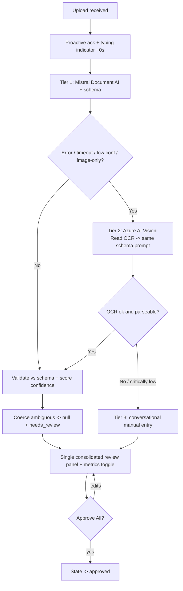

# Request for Comments (RFC) / Tech Spec

**Title:** Syllabus Ingestion & Confidence-Scored Extraction Pipeline
**Date:** 2026-05-19
**Author:** Axon Enjin
**Status:** `Approved`
**PRD Reference:** [prd-mate.md](prd-mate.md) §3 (Syllabus ingestion & parsing, Confidence-scored extraction), §4 (US-01, US-04), §7 (AI/Agent spec)
**SDD Reference:** [sdd-mate.md](sdd-mate.md) §2 (Extraction Action), §4 (external integrations), §8 (AI architecture)
**RFC ID:** `mate-rfc-001`

---

## 1. Context & Objective

**The problem this solves:**
Syllabus parsing is *the* killer feature and the single biggest accuracy risk. Unconstrained LLM date extraction shows 5–15% error rates; a wrong deadline written to a student's plan is the existential product risk and directly costs the competition's 50% Data Accuracy criterion. This RFC specifies the ingestion pipeline that takes an uploaded syllabus and returns a structured, confidence-scored, human-confirmable set of assessments — driving the error rate below 2% — while masking the ~10–20s latency so the UX criterion is not sacrificed for accuracy.

**Reference in PRD/SDD:**
This RFC implements the PRD "Syllabus ingestion & parsing" + "Confidence-scored extraction + transparency toggle" Must/Should features and the SDD §2 Extraction Action and §8 AI architecture.

**Success criteria:**
- Date-extraction error rate **< 2%** on the demo PH-syllabus corpus (structured schema + grounding + null-if-ambiguous + human confirm).
- **Zero fabricated dates**: an ambiguous/absent date returns `null` + `needs_review`, never a guess.
- Proactive acknowledgment fires **< 1s** after upload; full parse returns **p95 10–20s**, never a silent wait.
- Every low-confidence item is visibly flagged; nothing is committed without a single batch "Approve All".
- Image-only/low-quality scans degrade to OCR, then to manual entry — never a dead end or a crash.

---

## 2. Proposed Solution

**Approach:**
A three-tier extraction cascade fronted by an immediate latency-mask message and terminated by a batch human-in-the-loop gate.

1. **Acknowledge (≈0s):** On file receipt the agent fires a proactive message ("Got it! Reading your syllabus now… 📄") and shows the host typing indicator. This is decoupled from parsing so latency is never visible as a frozen UI.
2. **Tier 1 — Mistral Document AI (primary):** The document is sent to Mistral Document AI with a fixed JSON output schema and an explicit instruction: *return `null` for any date you are not certain maps to a specific calendar date; never infer a year or fill a range.* Returns candidate assessments with per-field model confidence.
3. **Tier 2 — Azure AI Vision Read (OCR fallback):** Triggered when Tier 1 errors, times out (>~20s), or returns aggregate confidence below threshold, or the document is detected as image-only/scanned. OCR text is then re-run through the same schema-bound extraction prompt.
4. **Tier 3 — Conversational manual entry (terminal fallback):** If Tier 2 also fails or confidence is critically low, the agent switches to guided conversational entry. Never a fabricated result, never a hard stop.
5. **Validate & score:** Output is validated against the JSON schema. Each assessment gets a normalized `confidence` (0–1) and a `review_state`. Dates outside the term window, conflicting dates across sections, or missing year/timezone (with no term header to default from) are coerced to `needs_review` with `due_at = null`.
6. **Propose (not commit):** Results render as a single consolidated review panel in Mate's UI (Adaptive Card form when embedded in Teams/Outlook). `needs_review` rows carry a ⚠ glyph + label and pre-focus a date picker. A "View metrics" toggle reveals raw confidence %. The proposal is persisted as `review_state != approved` — not yet truth.
7. **Batch approve:** Only "Approve All" flips state to `approved`. Nothing is written before that.



**Architecture changes:**
- New `extractSyllabus(document)` service implementing the cascade as a Mate backend Azure Function — demo and v1 alike (no Copilot Studio host dependency).
- Fixed extraction **JSON schema** as a cached prompt prefix shared by Tier 1 and Tier 2.
- Confidence scoring + `needs_review` coercion layer between extraction and the review panel.
- Proposals and approved items persist via the Mate backend to the SDD §3 `assessments`/`courses` Cosmos containers (demo uses a disposable pilot instance); no new tables introduced by this RFC.

---

## 3. Technical Details & Contracts

### Data Model Changes

No new tables. The service's output maps directly onto the existing SDD §3 `assessments` / `courses` Cosmos containers, persisted from the demo onward (disposable pilot instance for the competition).

### API Changes

```
Action: extractSyllabus

Request:
{
  "document": "<base64 | file ref>",
  "filename": "string",
  "term_hint": "string | null"   // e.g. "AY 2026-2027, 1st Sem" if known
}

Response:
{
  "course": { "name": "string", "term_label": "string | null" },
  "assessments": [
    {
      "title": "string",
      "due_at": "ISO-8601 | null",      // null = ambiguous, NEVER inferred
      "is_major": true,
      "confidence": 0.0,                 // 0..1
      "review_state": "needs_review | ok",
      "evidence": "string"               // verbatim source snippet (grounding)
    }
  ],
  "tier_used": "mistral | azure_vision | manual",
  "aggregate_confidence": 0.0
}
```

Contract rules: `due_at = null` ⇒ `review_state = "needs_review"`. `confidence < THRESHOLD` (default **0.75**) ⇒ `review_state = "needs_review"`. `evidence` must be a verbatim substring of the source — if a candidate has no source snippet it is dropped and logged, never surfaced (anti-hallucination).

### State Management

The proposal is persisted server-side (Cosmos `assessments` with `review_state != approved`); Mate's review panel binds to it via the API. "Approve All" is the only transition to truth (`needs_review|ok` → `approved`). Row edits PATCH the proposal and re-render the panel. The client polls `GET /api/proposals/{id}` while parsing runs (behind the latency mask). Same machine for demo and v1 — the demo just runs against a disposable pilot Cosmos instance.

---

## 4. Alternatives Considered

| Option | Why Rejected |
|--------|--------------|
| Single unconstrained LLM pass (e.g., GPT directly on PDF text) | 5–15% date-error rate per practitioner reports; fabricates years/ranges; no layout awareness for multi-column/merged-cell tables — fails the 50% Data Accuracy criterion |
| Azure Document Intelligence as primary | 2025 DSL-QA benchmark: vision-language models (Mistral Document AI) outperform Azure Document Intelligence for layout-aware parsing *at lower cost*; keep Azure Vision Read only as the OCR fallback it is best at |
| Synchronous parse with no latency mask | ~10–20s of dead air reads as a crash; directly damages the judged UX criterion; cheap to mitigate with a 0s proactive message |
| Per-item approval prompts | Notification fatigue (the exact incumbent failure mode the PRD forbids); batch "Approve All" is mandated by PRD emotional-safety + UX constraints |
| Auto-accept high-confidence items, only review low ones | Silently-written deadlines violate the PRD "no silently-written (unconfirmed) deadlines" rule and the trust-by-design principle; one batch review is the floor |

---

## 5. AI / Agent Implementation Notes

**Model used:** Mistral Document AI (Tier 1 extraction); Azure AI Vision Read (Tier 2 OCR); the same schema-bound extraction prompt applied to both. Microsoft Copilot (Copilot / Azure OpenAI), invoked server-side by Mate's backend, drives the surrounding conversation/HITL turns.
**Prompt strategy:** Static prefix = the fixed JSON schema + the null-if-ambiguous + evidence-must-be-verbatim rules; this prefix is identical on every call and is cached for cost/latency. Dynamic suffix = the document (or OCR text) + optional `term_hint`.
**Tool calls in this feature:** `extractSyllabus` (read-only on input; output is a proposal). The only write, `approveAll`, is out of this tool's surface and gated behind explicit batch HITL.

**Edge cases specific to LLM behavior:**
- Model tempted to infer a missing year/time → schema + instruction force `null`; post-validation double-checks any `due_at` resolves to a real calendar date within the term window, else coerce to `needs_review`.
- Multi-column layout / merged-cell tables → all candidates returned flagged for review rather than silently picking one.
- Conflicting dates across sections (calendar vs. assessment table) → both surfaced as a conflict; never auto-merged.
- "TBA"/"TBD"/date ranges → `due_at = null`, `needs_review`, title preserved.
- Model returns an item with no `evidence` substring present in source → dropped + logged (hallucination guard), not shown.
- Output truncation on a long syllabus → detect incomplete JSON; re-request remaining assessments with a continuation prompt before rendering.

**Token budget for this feature:** $0.002–$0.01 per syllabus (Mistral primary); ≤$0.01 on Azure Vision fallback. Cached schema prefix keeps marginal cost near the floor. Demo volume (a few syllabi) is financially negligible; free-tier model routing is a commercial-economics concern, out of scope here.

---

## 6. Security, Privacy & Performance

**Security surface:**
- Uploaded document is untrusted input: enforce max file size and accepted MIME types (PDF/doc) before dispatch; reject anything else with a clear message.
- `evidence` is echoed back to the UI — it is a verbatim source substring only; never reflect raw model free-text into the card without schema validation.

**Performance:**
- p95 parse 10–20s, fully behind the latency mask; Tier 2 only adds cost when Tier 1 fails — it is not run speculatively in parallel for the demo (cost discipline; revisit speculative parallelism only if p95 unacceptable).
- Bounded retries: GPT/agent reasoning ≤2 backoff retries; extraction tiers are sequential and bounded (max 3 tiers), so worst-case latency is deterministic.

**Privacy:**
- Mate handles only syllabus *deadline* data, deliberately not grades/transcripts, minimizing exposure of RA 10173 Sensitive Personal Information. Because the demo persists real (limited, consenting pilot) data, DPA obligations partially apply at demo stage — not just at v1. Obligations (encryption at rest, PH/SEA region, DSR deletion, no model training on student data) are registered in [clr-mate.md](clr-mate.md) and architected in [sdd-mate.md](sdd-mate.md) §5.

---

## 7. Execution Plan

**Can this ship behind a feature flag?** Partially — the Tier-2 OCR fallback and the "View metrics" transparency toggle are independently switchable; the Tier-1 path + batch approval are the irreducible demo core and ship together.

**Ticket breakdown** (created on RFC approval):

| Ticket | Description | Size |
|--------|-------------|------|
| `mate-rfc-001-01` | Define + freeze extraction JSON schema and the null-if-ambiguous/evidence-verbatim prompt prefix | S |
| `mate-rfc-001-02` | Implement `extractSyllabus` Tier 1 (Mistral) with schema-bound output + confidence | M |
| `mate-rfc-001-03` | Latency-mask: 0s proactive ack + typing indicator wired before parse | S |
| `mate-rfc-001-04` | Validation + `needs_review` coercion layer (term-window check, conflict/range/TBA handling, evidence guard) | M |
| `mate-rfc-001-05` | Tier 2 Azure AI Vision Read OCR fallback feeding the same prompt | M |
| `mate-rfc-001-06` | Review panel render (Mate UI; Adaptive Card embed form): flags, editable rows, "View metrics" toggle, single "Approve All" | M |
| `mate-rfc-001-07` | Tier 3 conversational manual-entry terminal fallback | S |
| `mate-rfc-001-08` | Accuracy harness on PH-syllabus corpus; tune THRESHOLD to hit <2% error (feeds [qad-mate.md](qad-mate.md)) | M |

**Rollout order:** schema (01) → Tier 1 (02) → latency mask (03) → validation/scoring (04) → review panel (06) → Tier 2 (05) → Tier 3 (07) → accuracy harness + threshold tuning (08). This maps to PRD §9 milestones M0 (01–03), M1 (04–07), M2 (08 + demo prep). Keep the milestone mapping consistent with [prd-mate.md](prd-mate.md) §9.

---

## Self-Check

- [x] Section 3 has exact contract shapes and an explicit "no schema changes required" for the demo
- [x] Section 3 API change has exact request/response JSON
- [x] Section 4 has real rejected alternatives (Azure Document Intelligence primary, unconstrained single-pass, per-item approval) — not strawmen
- [x] Section 5 filled (AI is the feature)
- [x] Section 7 tickets are immediately actionable and mapped to PRD §9 milestones
- [x] No duplication of PRD feature scope or SDD global architecture — this RFC is the pipeline depth only
