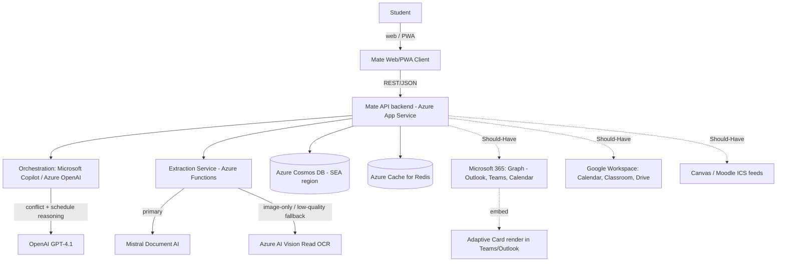

# System Design Document (SDD)

**Project:** Mate — Autonomous Academic Orchestrator
**Date:** 2026-05-19
**Version:** 0.2
**Owner:** Axon Enjin
**PRD:** [prd-mate.md](prd-mate.md)

---

## 1. Architectural Vision & Principles

**Architecture style:** Mate is an **independent SaaS**: a responsive web/PWA client, a stateless API backend, and a persistent data store, with **Microsoft Copilot (Copilot / Azure OpenAI) as the AI engine invoked via API** from Mate's backend. The same architecture serves the KPMG competition demo and commercial v1 — the demo is the first deployable slice of the real product, not a Copilot Studio bot. Azure is the hosting choice; the integration layer is deliberately ecosystem-agnostic (Microsoft 365 *and* Google Workspace).

**Guiding principles:**
- **Mate owns its UX, data, and integrations; Copilot is a service it calls.** The product boundary is the Mate SaaS, not any vendor host. Copilot powers orchestration and generation behind Mate's own API.
- **AI decides, deterministic code does the work.** Copilot orchestrates reasoning; a constrained extraction service returns structured JSON against a fixed schema. The model never freely writes a date — it returns `null` when unsure.
- **Nothing is persisted as truth without human approval.** Extraction output is a *proposal* until the student hits "Approve All". No silent calendar/state writes (PRD emotional-safety constraint).
- **Accuracy over autonomy where they conflict.** Confidence scoring + "needs review" flags + manual-entry fallback are first-class — Data Accuracy is 50% of the competition grade and a wrong deadline is the existential product risk.
- **Fail loudly in dev, gracefully in prod.** Parse failure routes to guided manual entry — never a dead end or a fabricated result.

**Key trade-offs made (explicit V1 tech debt):**
- **ICS-feed LMS sync before deep APIs.** Canvas/Moodle full API access is a 6–18 month per-institution relationship; per-user ICS is zero-admin and ships first. Documented debt: ICS is read-only and polling-based.
- **No background job queue for v1.** The ~10–20s parse runs inline behind a latency-mask, not a queue; a queue is added before thousands of concurrent users.
- **Single region (Azure SEA) for v1.** PH data-localization is satisfied by one SEA region; multi-region is post-scale.
- **Integration breadth phased.** Demo proves the core flow; Microsoft 365 (Teams/Outlook/Graph) and Google Workspace (Calendar/Classroom/Drive) connectors are Should-Have, layered after the judged capabilities are solid.
- **Demo persists to a disposable store.** The demo uses the real Cosmos DB schema in a non-production instance with a limited, consenting pilot dataset — not session-only mocks — so the demo is genuinely the v1 foundation.
- **Demo runs on dev/test-licensed Azure (MLSA / Visual Studio Enterprise subscription).** The competition demo is hosted on a teammate's Microsoft Learn Student Ambassador Visual Studio Enterprise subscription (monthly Azure dev/test credit) and an associated Microsoft 365 developer tenant for Graph/Teams/Outlook integration development. **This is dev/test-licensed — it must not host production or any public/paying workload, and production identity/billing must not depend on a personal ambassador account** (bus-factor + ToS + DPA data-controller risk). Documented debt: commercial v1 requires migration to a separate, org-owned, commercially-licensed Azure subscription (e.g., Azure for Startups / Founders Hub) and an org-owned tenant before any public or paying user — planned as a migration, not a lift-and-keep.

---

## 2. High-Level Architecture

**Layers:**

| Layer | Technology | Responsibility |
|-------|------------|----------------|
| Client | Mate responsive web / PWA (native iOS/Android later, same API) | Upload + NL input; render review/conflict/plan panels; collect batch approval |
| API / Gateway | Mate backend on Azure App Service (REST/JSON) | Auth, request orchestration, proposal/approve state machine, integration fan-out |
| Orchestration AI | Microsoft Copilot / Azure OpenAI (GPT-class), called via API | Intent routing, lateral-language handling, clarifying questions, conflict reasoning, schedule generation |
| Extraction service | Azure Functions | Call Mistral → fall back to Azure Vision → normalize to schema → attach confidence |
| Reasoning model | OpenAI GPT-4.1 | Conflict-window detection + schedule narration |
| Data | Azure Cosmos DB (SEA region); Azure Cache for Redis | Persist users/courses/assessments/plans; cache ICS ETags + rate counters |
| Integrations | Microsoft Graph; Google Workspace APIs; LMS ICS | Two-way calendar/task sync; course/deadline import; Teams/Outlook embeds |
| Infrastructure | Azure App Service + Functions + Key Vault | Host the SaaS; ecosystem-agnostic at the integration boundary |

---

## 3. Data Architecture

**Primary database:** Azure Cosmos DB (SEA region) — *reason: PH data-localization preference under RA 10173; document model matches the syllabus→assessments shape; same instance pattern from demo through v1.* The demo uses a non-production Cosmos instance with a limited consenting pilot dataset (disposable), not mocks.
**Secondary / cache:** Azure Cache for Redis — *reason: ICS-poll ETag dedupe and per-user rate-limit counters.*
**Vector store (if AI):** N/A — extraction is schema-constrained document parsing, not RAG. (A future v2 "AI study companion grounded in course materials" would add a vector store; out of scope here.)

### Backend Schema

> Cosmos is schemaless; the table form expresses the enforced document contract, applied from the demo onward.

**Container: `users`** (partition key: `/id`)

| Field | Type | Null? | Default | Key / Index | Constraint |
|-------|------|-------|---------|-------------|------------|
| `id` | string (GUID) | No | generated | PK / partition | — |
| `auth_subject` | string | No | — | unique idx | from Mate auth identity |
| `locale` | string | No | `"fil-PH"` | — | enum: `fil-PH` \| `en-PH` |
| `created_at` | string (ISO-8601) | No | now() | — | UTC |

**Container: `courses`** (partition key: `/user_id`)

| Field | Type | Null? | Default | Key / Index | Constraint |
|-------|------|-------|---------|-------------|------------|
| `id` | string (GUID) | No | generated | PK | — |
| `user_id` | string | No | — | partition / FK → `users.id` | ON DELETE cascade (app-enforced) |
| `name` | string | No | — | — | non-empty |
| `term_label` | string | Yes | — | — | used to default missing year/timezone |
| `source_doc_hash` | string | No | — | idx | dedupe re-uploads |

**Container: `assessments`** (partition key: `/user_id`)

| Field | Type | Null? | Default | Key / Index | Constraint |
|-------|------|-------|---------|-------------|------------|
| `id` | string (GUID) | No | generated | PK | — |
| `user_id` | string | No | — | partition | FK → `users.id` |
| `course_id` | string | No | — | idx | FK → `courses.id` |
| `title` | string | No | — | — | non-empty |
| `due_at` | string (ISO-8601) | Yes | `null` | idx | **`null` if ambiguous — never fabricated** |
| `is_major` | bool | No | `false` | — | drives conflict detection |
| `confidence` | number | No | — | — | 0.0–1.0; `< threshold` ⇒ "needs review" |
| `review_state` | string | No | `"needs_review"` | — | enum: `needs_review` \| `approved` |
| `approved_at` | string (ISO-8601) | Yes | `null` | — | set only on batch "Approve All" |
| `synced_targets` | array<string> | No | `[]` | — | which integrations this was pushed to (m365/google/lms) |

**Container: `study_blocks`** (partition key: `/user_id`)

| Field | Type | Null? | Default | Key / Index | Constraint |
|-------|------|-------|---------|-------------|------------|
| `id` | string (GUID) | No | generated | PK | — |
| `user_id` | string | No | — | partition | FK → `users.id` |
| `assessment_id` | string | Yes | — | idx | FK → `assessments.id` |
| `start_at` / `end_at` | string (ISO-8601) | No | — | — | must not overlap stated unavailable times |
| `state` | string | No | `"proposed"` | — | enum: `proposed` \| `approved` |

**Container: `integration_links`** (partition key: `/user_id`)

| Field | Type | Null? | Default | Key / Index | Constraint |
|-------|------|-------|---------|-------------|------------|
| `id` | string (GUID) | No | generated | PK | — |
| `user_id` | string | No | — | partition | FK → `users.id` |
| `provider` | string | No | — | idx | enum: `microsoft365` \| `google_workspace` \| `lms_ics` |
| `scope` | array<string> | No | `[]` | — | granted OAuth scopes |
| `token_ref` | string | No | — | — | Key Vault reference, never raw token |

**Key relationships:** User 1:N Courses; Course 1:N Assessments; Assessment 1:N Study Blocks; User 1:N Integration Links. Conflict detection = query over `assessments` where `is_major = true` grouped into 7-day windows per `user_id`.

**Indexes & performance:** partition by `user_id` for all student-scoped containers (single-student query is the hot path); secondary index on `assessments.due_at` for the collision-window scan and `courses.source_doc_hash` for re-upload dedupe.

**Migration strategy:** Cosmos is schemaless; the contract is enforced in the extraction/validation layer. Versioned `schema_version` field; forward-only additive changes; one release of backward-compatibility before removing a field, so a bad deploy rolls back without data loss.

**Caching strategy:** Redis for ICS-poll ETags (TTL = poll interval) and per-user rate counters (TTL 60s).

---

## 4. API Design & External Integrations

**API style:** REST/JSON between the Mate client and the Mate backend. Copilot/Azure OpenAI is invoked server-side only (keys never reach the client).

**Internal endpoints (high-level):**

| Method | Path | Purpose |
|--------|------|---------|
| `POST` | `/api/syllabi` | Upload a syllabus → triggers extraction; returns a proposal id + immediate ack |
| `GET` | `/api/proposals/{id}` | Fetch the extraction proposal (poll while parsing) |
| `PATCH` | `/api/proposals/{id}/items/{itemId}` | Edit a row before approval |
| `POST` | `/api/proposals/{id}/approve` | Batch "Approve All" — the only write-to-truth gate |
| `GET` | `/api/conflicts` | 7-day collision windows + intervention |
| `POST` | `/api/plan` | Generate study blocks from availability |
| `POST` | `/api/integrations/{provider}/connect` | OAuth connect Microsoft 365 / Google Workspace / LMS ICS |

**External integrations:**

| Service | Purpose | Rate Limits / Fallback |
|---------|---------|------------------------|
| Microsoft Copilot / Azure OpenAI | Orchestration + generation (server-side) | 429 → backoff ≤2×, then graceful user message; provision quota headroom |
| Mistral Document AI | Primary syllabus parsing → structured JSON | Error/low-confidence/timeout (>~20s) → Azure AI Vision Read; never block — degrade to manual entry |
| Azure AI Vision Read | OCR fallback (scanned/image-only/low-quality) | On failure → guided manual-entry flow; surfaced to user, not silent |
| OpenAI GPT-4.1 | Conflict reasoning + schedule text | 429 → retry w/ backoff ≤2×, then graceful message |
| Microsoft 365 (Graph) | Outlook calendar + tasks two-way sync; Teams notifications/embeds (Adaptive Card) | OAuth; token refresh; write only after approval; Should-Have |
| Google Workspace | Google Calendar two-way sync; Classroom course/deadline import; Drive document pickup | OAuth; token refresh; write only after approval; Should-Have |
| Canvas / Moodle ICS | Per-user deadline feed | Polled w/ ETag; read-only; dedupe via `source_doc_hash`; Should-Have |

---

## 5. Security & Authorization

**Authentication:** Mate-owned auth (email/identity provider; Microsoft/Google sign-in optional but not required — sign-in choice is independent of the integration choice). Demo uses a limited pilot identity set.
**Session management:** short-lived access tokens + refresh; tokens in httpOnly cookies; no long-lived secrets in the client.
**Authorization model:** owner-check only — a student can read/write exclusively their own `user_id`-partitioned data. No roles for v1; institutional/RBAC deferred to the B2B phase.

**Data protection:**
- PH education records (grades, academic standing) are **Sensitive Personal Information under RA 10173 §3(l)(2)**. Mate deliberately handles only syllabus *deadline* data — not grades/transcripts — to minimize SPI exposure, including in the demo. Because the demo persists real (pilot) data, DPA obligations partially apply at demo stage; see [clr-mate.md](clr-mate.md).
- Encryption at rest (Cosmos DB encryption + customer-managed keys), SEA region, no foundation-model training on student data.
- Integration tokens stored as Key Vault references (`token_ref`), never raw in the database; model/API keys in Key Vault, never committed or client-exposed.
- Input validation: extraction output validated against the fixed JSON schema before display; out-of-schema or implausible dates (outside the term window) coerced to `needs_review`, never accepted; uploaded files size/MIME-checked before dispatch.

---

## 6. Infrastructure, CI/CD & Deployment

**Hosting:** Azure App Service (Mate API + web/PWA), Azure Functions (extraction/scheduling), Azure Cosmos DB (SEA region), Azure Cache for Redis, Azure Key Vault — all PH/SEA region for DPA localization.

**Subscription & licensing:**
- **Competition demo:** hosted on a teammate's Microsoft Learn Student Ambassador **Visual Studio Enterprise** subscription (monthly Azure dev/test credit) plus an associated **Microsoft 365 developer tenant** used to build/test the Graph, Outlook, and Teams integrations against sandbox users (Google Workspace integration developed in parallel via a Google Cloud project with test users). Confirm **Azure OpenAI** access and the M365 dev tenant are both active on that account — they unlock the orchestration engine and the integration demo respectively.
- **Hard constraint:** dev/test-licensed Azure must **not** run production or any public/paying workload, and production identity/billing must not be tied to a personal ambassador account (ToS, bus-factor, DPA data-controller accountability — see [clr-mate.md](clr-mate.md)).
- **Commercial v1 migration (required before any public/paying user):** stand up a separate, org-owned, commercially-licensed Azure subscription (e.g., Azure for Startups / Founders Hub) and an org-owned identity tenant; migrate hosting, data, and secrets. Treat as a planned migration milestone, not a lift-and-keep.

**Environments:**
- `dev`: local + Azure dev slot (ambassador VS Enterprise subscription); sample PH-syllabi corpus as fixtures; M365 dev tenant for integration work.
- `staging`: Azure staging slot; demo dry-run + accuracy harness run before submission.
- `prod`: Azure production slot (deployment slots enable blue/green); the competition demo runs on a controlled staging/prod slot with a limited pilot cohort. **Commercial production is a distinct, org-owned subscription stood up at the v1 migration — not this slot.**

**CI/CD:** GitHub Actions on `Axon-Enjin/mate` → lint → type-check → test + extraction-accuracy harness → deploy to Azure staging slot on PR → slot-swap to prod on tagged release. DB changes additive and backward-compatible for one release.

---

## 7. Non-Functional Requirements

| Requirement | Target | Notes |
|-------------|--------|-------|
| Upload acknowledgment latency | < 1s | The latency mask — must precede parse; judged UX criterion |
| Full syllabus parse (p95) | 10–20s | Mistral primary; masked with progress feedback |
| Date-extraction error rate | < 2% | Structured schema + grounding + null-if-ambiguous + human confirm (vs 5–15% unconstrained) |
| Per-syllabus parse cost | $0.002–$0.01 | Mistral primary; Azure Vision on fallback |
| API response (p95, non-AI) | < 300ms | CRUD/proposal endpoints |
| Uptime | Demo: best-effort on staging/prod slot | v1 target 99.5% |
| Max concurrent users | Demo: limited pilot cohort | v1 designed for hundreds; queue before thousands |
| Data retention | Demo pilot data deletable on request; v1 per CLR / DPA 15-day DSR window | |

---

## 8. AI / Agent Architecture

**AI approach:** Microsoft Copilot (Copilot / Azure OpenAI, GPT-class) is the orchestration/reasoning/conversation engine, invoked server-side by Mate's API. A deterministic, schema-constrained extraction service does document parsing (Mistral Document AI primary, Azure AI Vision Read OCR fallback). OpenAI GPT-4.1 handles conflict-reasoning and schedule-generation text. Not RAG — extraction is layout-aware parsing bound to a fixed JSON schema with explicit "return null if ambiguous" rules.

**Model selection:**

| Agent / Task | Model | Reason |
|-------------|-------|--------|
| Conversation orchestration, lateral-language, clarifying questions | Microsoft Copilot / Azure OpenAI (GPT-class) | Copilot is the primary AI per the brief; called via API so Mate stays an independent SaaS |
| Syllabus document extraction | Mistral Document AI | 2025 DSL-QA benchmark: VLMs outperform Azure Document Intelligence for layout-aware parsing at lower cost; <$0.01/parse |
| OCR fallback (scanned/image-only) | Azure AI Vision Read | Robust OCR for low-quality scans/handwriting |
| Conflict reasoning + schedule text | OpenAI GPT-4.1 | Strong structured reasoning for collision detection and plan narration |

**Context architecture:**
- System prompt: base orchestration instructions + injected student context (availability/priorities) + current proposal JSON. Extraction prompt carries the fixed output schema and the null-if-ambiguous rule.
- Max context per request: modest — a single syllabus + session state; no large retrieval corpus.
- Prompt caching: cache the static extraction-schema/system prefix (identical on every parse) for cost/latency; expect high prefix cache-hit.

**Tool surface (server-side actions):**

| Tool | Purpose | Risk Level |
|------|---------|------------|
| `extractSyllabus` | Parse document → schema JSON + confidence | Read-only on input; medium (accuracy-critical) — output is a proposal |
| `detectConflicts` | Compute collision windows | Read-only, low |
| `proposeSchedule` | Generate study blocks | Read-only, low (proposal only) |
| `approveAll` | Commit proposal → approved state | **Write — gated behind explicit batch HITL** |
| `syncToProvider` | Push approved items to M365 / Google / LMS | Write — only after approval + OAuth consent; high |

**HITL gates:**
- No assessment or schedule is committed until the student presses "Approve All" — single batch action, no per-item fatigue.
- Low-confidence items (`confidence < threshold`) are flagged "needs review" and never auto-approved.
- Conflicting dates across syllabus sections surfaced as conflicts, never auto-merged; missing year/timezone defaults to the term header only when present, else `null` + review.
- Integration writes (calendar/tasks) require a prior approval and OAuth consent.

**Token / cost budget:**

| Operation | Est. cost | Monthly budget assumption |
|-----------|-----------|---------------------------|
| Syllabus parse (Mistral primary) | $0.002–$0.01 | Demo pilot volume — negligible |
| Syllabus parse (Azure Vision fallback) | ≤ $0.01 | Only image-only/low-quality scans |
| Substantive orchestration interaction | ~$0.05–$0.15-equivalent | Provision quota headroom; free-tier model routing is a commercial-economics concern, not a demo blocker |

**Fallback behavior:** Mistral error/low-confidence/timeout → Azure Vision Read; Azure Vision failure or critically low confidence → guided manual-entry flow (never a fabricated date, never a dead end). Copilot/GPT error → ≤2 silent backoff retries, then a clear user-facing "let's try that again". Every fallback is visible to the student (trust-by-design).

---

## Self-Check

- [x] Section 2 has an actual Mermaid diagram (independent SaaS; Copilot as a called service; integrations dashed/Should-Have)
- [x] Section 3 defines every container with typed fields, keys, constraints; persisted from the demo onward
- [x] Section 3 has a forward-only, one-release-backward-compatible migration strategy
- [x] Every external integration in Section 4 has a rate-limit / fallback strategy
- [x] Section 7 latency/accuracy targets are specific numbers
- [x] Section 8 filled (AI is core); Copilot is the engine, not the product boundary
- [x] V1 shortcuts documented as explicit tech debt in Section 1
- [x] This document answers *how* to build; *what* stays in [prd-mate.md](prd-mate.md)

---

*Next in sequence: [rfc-mate-syllabus-ingestion.md](rfc-mate-syllabus-ingestion.md) — the ingestion/extraction pipeline has real architectural trade-offs and gets its own RFC.*
